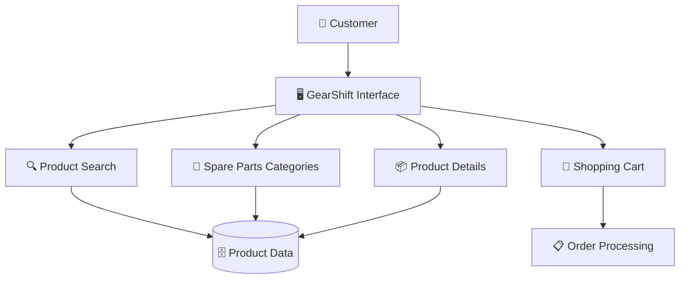
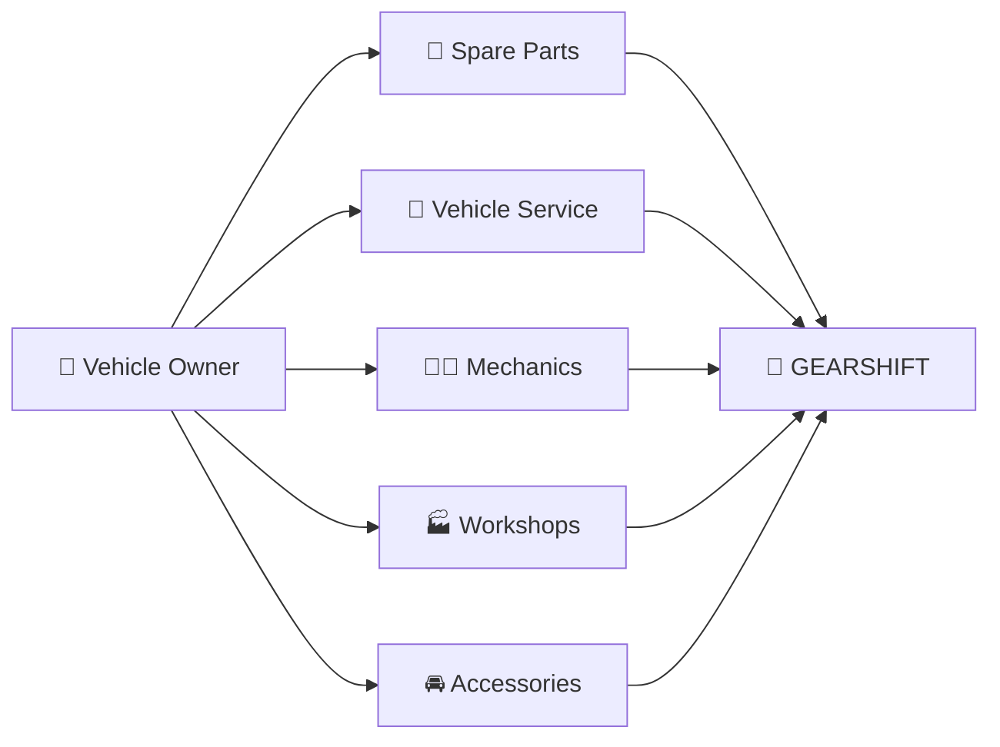

# 🚗 GearShift — Automobile Spares

<p align="center">
  
  
  
</p>

<p align="center">
  <b>🚘 A dedicated digital platform for discovering and managing automobile spare parts.</b>
</p>

<p align="center">
  <a href="https://github.com/AravindInish/Gearshift-Automobile-spares">
    
  </a>
</p>

---

## 📌 About The Project

**GearShift – Automobile Spares** is an automobile-focused spare-parts platform designed to make the process of discovering and accessing vehicle components easier and more organized.

The project focuses on bringing automobile spare parts into a dedicated digital environment where users can explore products, identify required components, and have a smoother overall shopping experience.

Instead of searching across multiple platforms, GearShift aims to provide a **centralized automobile spare-parts experience**.

---

## 🎯 Project Vision

> **"Shift into a smarter way of finding automobile spares."**

GearShift is built around a simple idea:

**Vehicle → Required Part → Discover → Select → Purchase**

The platform can serve automobile owners, enthusiasts, mechanics, workshops, and anyone looking for vehicle-related spare parts.

---

## ✨ Key Highlights

### 🚘 Automobile-Focused Platform

A platform specifically designed around the automobile spare-parts ecosystem.

### 🔍 Easy Product Discovery

Users can explore available automobile components and find the parts relevant to their requirements.

### 🧩 Spare Parts Organization

Automobile components can be organized into meaningful categories to simplify navigation.

### 🛒 Shopping Experience

Designed with the foundation of an e-commerce experience for automobile spare parts.

### 📱 User-Friendly Interface

A clean interface focused on making spare-parts discovery simple and convenient.

### ⚙️ Scalable Concept

The project can be extended with additional automotive services and intelligent features in future versions.

---

## 🔄 How GearShift Works


---

## 🏗️ Platform Architecture



---

## 🧩 Core Modules

| Module        | Description                           |
| ------------- | ------------------------------------- |
| 🚗 Vehicle    | Vehicle-oriented spare-part discovery |
| 🔍 Search     | Find required automobile components   |
| 🧩 Categories | Organize spare parts efficiently      |
| 📦 Products   | Display spare-part information        |
| 🛒 Cart       | Manage selected products              |
| 📋 Orders     | Handle purchase workflow              |
| 👤 Users      | Provide a personalized experience     |

---

## 🚘 Automobile Spare Parts

GearShift can be expanded to support categories such as:

* 🔧 Engine Components
* 🛞 Wheels & Tyres
* 🛑 Brake Components
* ⚡ Electrical Parts
* 🔋 Battery Components
* 💡 Lighting & Accessories
* ❄️ AC & Cooling Components
* 🛢️ Lubricants & Filters
* 🚗 Body & Exterior Parts
* 🪑 Interior Components
* ⚙️ Transmission Components
* 🧰 Maintenance Accessories

---

## 🛍️ User Journey

```text
                 ┌───────────────┐
                 │   👤 USER     │
                 └───────┬───────┘
                         │
                         ▼
                ┌─────────────────┐
                │ 🚗 Select Car   │
                └────────┬────────┘
                         │
                         ▼
                ┌─────────────────┐
                │ 🔍 Find Part    │
                └────────┬────────┘
                         │
                         ▼
                ┌─────────────────┐
                │ 📦 View Details │
                └────────┬────────┘
                         │
                         ▼
                ┌─────────────────┐
                │ 🛒 Add to Cart  │
                └────────┬────────┘
                         │
                         ▼
                ┌─────────────────┐
                │ 💳 Checkout     │
                └────────┬────────┘
                         │
                         ▼
                ┌─────────────────┐
                │ ✅ Order Placed │
                └─────────────────┘
```

---

## 💡 Why GearShift?

Traditional spare-parts discovery can be difficult because users often need to know:

* Which part is compatible with their vehicle?
* Which category contains the required component?
* What alternatives are available?
* Where can the component be purchased?

GearShift aims to simplify this process by creating a **dedicated automobile spare-parts ecosystem**.

---

## 🚀 Future Enhancements

The platform can be extended with powerful automotive features:

* 🤖 **AI-based spare-part recommendations**
* 🚗 **Vehicle compatibility checker**
* 🔎 **Search by vehicle registration number**
* 📸 **Image-based spare-part identification**
* 📍 **Nearby spare-parts shops**
* 🛠️ **Mechanic & workshop integration**
* 📦 **Real-time inventory tracking**
* 💳 **Online payments**
* 🚚 **Order tracking**
* ⭐ **Product reviews & ratings**
* ❤️ **Wishlist**
* 🔔 **Price-drop notifications**
* 📊 **Admin dashboard**
* 📱 **Mobile application**

---

## 🌟 Future Vision

GearShift can evolve beyond a spare-parts store into a broader **automotive ecosystem** connecting:



---

## 🛠️ Getting Started

Clone the repository:

```bash
git clone https://github.com/AravindInish/Gearshift-Automobile-spares.git
```

Navigate into the project:

```bash
cd Gearshift-Automobile-spares
```

Then follow the project-specific setup instructions provided in the repository.

---

## 📁 Suggested Project Structure

```text
Gearshift-Automobile-spares/
│
├── 📁 assets/
├── 📁 components/
├── 📁 pages/
├── 📁 styles/
├── 📁 scripts/
├── 📁 data/
├── 📄 README.md
└── 📄 package.json
```

> The structure above is a conceptual organization. Adapt it to the actual repository structure.

---

## 🤝 Contributing

Contributions are welcome!

1. ⭐ Star the repository
2. 🍴 Fork the project
3. 🌱 Create a feature branch
4. 💻 Make the changes
5. 📤 Commit the changes
6. 🔀 Create a Pull Request

```bash
git checkout -b feature/NewFeature
git add .
git commit -m "Add new feature"
git push origin feature/NewFeature
```

---

## 📌 Project Goals

* 🚗 Simplify automobile spare-parts discovery
* 🔍 Improve product search
* 🧩 Organize automotive components
* 🛒 Provide a smoother shopping experience
* ⚙️ Build a scalable automotive platform
* 🤖 Introduce intelligent automotive features

---

## 👨‍💻 Developer

### Aravind Inish

Passionate about **Software Development, Artificial Intelligence, Web Applications, and innovative technology projects.**

<p align="center">
  <a href="https://github.com/AravindInish">
    
  </a>
</p>

---

## ⭐ Support

If this project is useful or interesting:

⭐ **Star the repository**

🍴 **Fork the project**

📢 **Share it with others**

💡 **Contribute new ideas**

---

<p align="center">
  <b>🚗 GearShift — Your Destination for Automobile Spares 🔧</b>
</p>

<p align="center">
  Built with passion for the automotive world.
</p>
